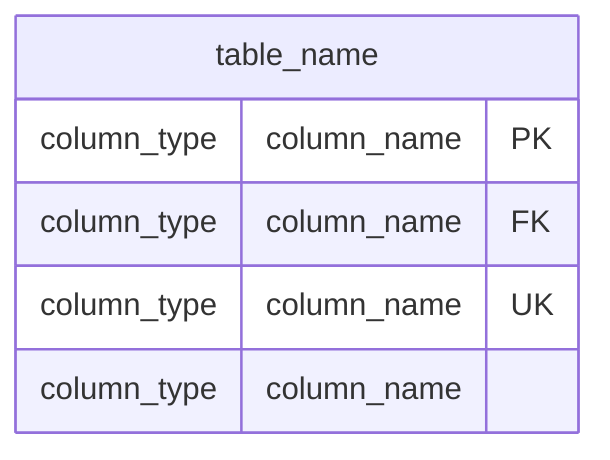

# Database Schema Mermaid Diagram Generator

Generate visual Entity-Relationship Diagrams (ERD) from Drizzle ORM schemas that render natively on GitHub using Mermaid.js syntax.

## When to Use This Skill

Use this skill when you need to:
- Create visual documentation for your database schema
- Generate ERD diagrams that render on GitHub (Mermaid.js support)
- Document database relationships, indexes, and constraints
- Create reference documentation for team members
- Visualize complex multi-table schemas

## How to Use

Invoke this skill and provide:
1. **Schema file location**: Path to your Drizzle schema files (typically `src/db/schemas/`)
2. **Output location**: Where to save the generated diagram (e.g., `docs/database-schema.md`)
3. **Optional**: Specific tables to include if you want a partial diagram

## Mermaid ERD Syntax Requirements

### Table Definition Format



**Key symbols:**
- `PK` - Primary Key
- `FK` - Foreign Key
- `UK` - Unique Key

### Relationship Syntax

```mermaid
    user ||--o{ posts : "has"
    category ||--o{ posts : "categorizes"
```

**Relationship types:**
- `||--||` - One-to-one
- `||--o{` - One-to-many
- `}o--||` - Many-to-one
- `}o--o{` - Many-to-many

### Critical Syntax Rules

#### 1. **Never Use Enum Blocks in ERD Diagrams**

❌ **WRONG** - This causes parse errors:
```mermaid
enum status {
    draft
    published
    archived
}
```

✅ **CORRECT** - Use SQL data types in table definitions:
```mermaid
post {
    varchar status
}
```

Then document enum values in regular markdown below the diagram.

#### 2. **Use SQL Data Types, Not Enum Names**

❌ **WRONG**:
```mermaid
post {
    status status  -- This will fail to render
}
```

✅ **CORRECT**:
```mermaid
post {
    varchar status  -- Use the underlying SQL type
}
```

#### 3. **Array Types Use Brackets**

For Drizzle array types (e.g., `text[]`):
```mermaid
applicant {
    text[] allTags
    assignment_type[] assignmentTypes
}
```

#### 4. **Vector Types**

For pgvector columns:
```mermaid
job {
    vector jobEmbedding
}
```

## Step-by-Step Generation Process

### 1. Read Schema Files

Read all schema files from your Drizzle setup:
- `src/db/schemas/index.ts` - Main exports and relations
- `src/db/schemas/all-schemas.ts` - Table definitions
- Individual schema files if separated (e.g., `auth/user.ts`, `jobs/job.ts`)

### 2. Extract Table Information

For each table, extract:
- **Table name** (from `pgTable` call)
- **Columns** with types and constraints
- **Primary keys** (`.primaryKey()`)
- **Foreign keys** (`.references()`)
- **Unique constraints** (`.unique()`)
- **Indexes** (especially GIN and HNSW for vector search)

### 3. Extract Relationships

From Drizzle `relations()` definitions, extract:
- One-to-many relationships
- Many-to-many relationships
- Self-referencing relationships (e.g., comment threads)

### 4. Extract Enums

From `pgEnum` definitions, collect:
- Enum name
- Enum values
- Document these in markdown, not in the Mermaid diagram

### 5. Generate Mermaid Diagram

Construct the ERD diagram following the syntax rules above.

### 6. Add Documentation

Below the diagram, add:
- **Schema overview** - Purpose of each table group
- **Key indexes** - GIN, HNSW, and other important indexes
- **Enum values** - All enum options with descriptions
- **Architecture notes** - Special patterns (e.g., 3-gate matching)

## Example Output Structure

```markdown
# Database Schema

```mermaid
erDiagram
    user {
        text id PK
        text email UK
        text name
    }

    post {
        integer id PK
        text userId FK
        varchar title
        varchar status
    }

    user ||--o{ post : "writes"
}
```

## Schema Overview

### Authentication Tables
- **user**: Core user account
- **session**: User sessions

### Content Tables
- **post**: Blog posts

## Key Indexes

### GIN Indexes
- `posts_tags_idx`: GIN index on post.tags

### HNSW Indexes
- `post_embedding_idx`: HNSW index on post.embedding

## Enum Values

### status
- `draft`
- `published`
- `archived`
```

## Common Drizzle Type Mappings

| Drizzle Type | Mermaid ERD Type |
|-------------|------------------|
| `text()` | `text` |
| `varchar()` | `varchar` |
| `integer()` | `integer` |
| `bigint()` | `bigint` |
| `boolean()` | `boolean` |
| `timestamp()` | `timestamp` |
| `uuid()` | `uuid` |
| `vector()` | `vector` |
| `text().array()` | `text[]` |
| `pgEnum()` | Use SQL type (e.g., `varchar`) |

## Special Index Documentation

### GIN Indexes (Tag Overlap)
Document GIN indexes used for array overlap queries:
```markdown
### GIN Indexes
- `table_tags_idx`: GIN index on table.tags
```

### HNSW Indexes (Vector Similarity)
Document HNSW indexes for vector search:
```markdown
### HNSW Indexes
- `table_embedding_idx`: HNSW index on table.embedding (cosine similarity)
```

## Troubleshooting

### Parse Errors

If you get "Parse error" on GitHub:
1. Check for enum blocks in the diagram - remove them
2. Verify no enum names are used as data types
3. Ensure all relationship syntax is correct
4. Check for unclosed brackets or quotes

### Diagram Not Rendering

If the diagram doesn't render:
1. Verify the mermaid code block is properly fenced
2. Check GitHub supports your Mermaid version (most ERD features are supported)
3. Ensure no special characters that need escaping

### Missing Relationships

If relationships don't appear:
1. Verify you extracted all `relations()` definitions
2. Check foreign key references are correct
3. Ensure relationship syntax uses proper cardinality symbols

## Best Practices

1. **Group related tables** with comments in the diagram
2. **Use descriptive relationship labels** (e.g., "writes", "belongs to")
3. **Document deprecated tables** clearly in the overview
4. **Include index documentation** for performance-critical queries
5. **Keep enum values in markdown** for better readability
6. **Add architecture notes** for complex patterns (e.g., multi-gate systems)

## Integration with Project

This skill works best with:
- Drizzle ORM schemas
- PostgreSQL with pgvector
- Next.js projects
- GitHub repositories (for native Mermaid rendering)

## File Location Recommendations

Place generated diagrams in:
- `docs/database-schema.md` - Main schema documentation
- `docs/database/` - Separate diagrams for different domains
- Root directory - `DATABASE_SCHEMA.md` for simple projects
