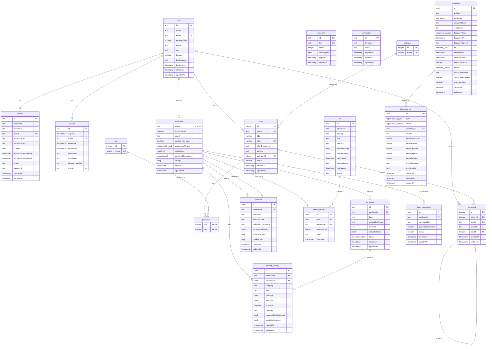

# VectorMatch Database Schema

## Schema Overview

### Authentication Tables
- **user**: Core user account with email verification, role management, and ban functionality
- **account**: OAuth provider accounts and password credentials
- **session**: User sessions with IP tracking and impersonation support
- **rate_limit**: Better Auth rate limiting for sliding-window algorithm
- **verification**: Email verification and password reset tokens

### Blog Tables (Deprecated)
These tables are retained for migration history only. The blog now uses static MDX files.
- **category**: Post categories
- **tag**: Post tags
- **post**: Blog posts with draft/published/archived status
- **post_tags**: Many-to-many relationship between posts and tags
- **comment**: Nested comment threads with parent-child relationships

### Jobs Tables
- **applicant**: User profile extended with job preferences, compliance options, and skill tags
- **job**: ATS-ingested job postings with extracted tags, vector embeddings, and dedup/stale tracking
- **persona**: User-defined job personas with must-have/blocklist tags and vector embeddings
- **match_queue**: Job-applicant matching results with overlap scores and status tracking
- **cv_upload**: CV upload lifecycle management with extraction status and raw text retention
- **working_history**: User's work history entries extracted from CVs or added manually
- **tags_experience**: Computed skills and years of experience per canonical tag (derived from working_history)

### Module B Tables — Seeding & Ingestion Pipeline
- **company**: ATS slug registry — discovered (ats_source, ats_slug) tuples with tier, health, and polling state. The Phalanx Poller reads from this table. No FK to `job` (logical relationship only, matched by atsSource + atsSlug).
- **ingestion_log**: Observability for every seeder, poller, tier recalculation, and stale cleanup run. Nullable FK to `company` (null for seed/cleanup runs).

## Key Indexes

### GIN Indexes (Tag Overlap - Gate 1)
- `jobs_extracted_tags_idx`: GIN index on job.extractedTags
- `persona_must_have_tags_idx`: GIN index on persona.mustHaveTags
- `persona_blocklist_tags_idx`: GIN index on persona.blocklistTags

### HNSW Indexes (Vector Similarity - Gate 2)
- `job_embedding_hnsw_idx`: HNSW index on job.jobEmbedding (cosine similarity)
- `persona_embedding_hnsw_idx`: HNSW index on persona.personaEmbedding (cosine similarity)

### Other Indexes
- `account_userId_idx`: Account lookups by user
- `session_userId_idx`: Session lookups by user
- `rate_limit_expires_at_idx`: Rate limit cleanup
- `verification_identifier_idx`: Token lookups
- `persona_applicant_id_idx`: Persona lookups by applicant
- `match_queue_unique`: Unique constraint on (jobId, applicantId)
- `cv_upload_applicant_id_idx`: CV upload lookups by applicant
- `cv_upload_applicant_status_idx`: Composite index for finding user's valid/active CVs
- `working_history_role_idx`: Work history lookups by role
- `working_history_applicant_id_idx`: Work history lookups by applicant
- `working_history_cv_upload_id_idx`: Work history lookups by CV upload
- `tags_experience_tag_idx`: Tags experience lookups by canonical tag
- `tags_experience_applicant_id_idx`: Tags experience lookups by applicant
- `tags_experience_unique`: Unique constraint on (applicantId, canonicalTag) for upsert operations

### Module B Indexes — Ingestion Pipeline
- `company_unique_ats_slug`: Unique index on (atsSource, atsSlug) — a company may use multiple ATS platforms
- `company_tier_polling_idx`: Composite index on (tier, pollingEnabled, lastPolledAt) for the poller's daily query
- `company_root_domain_idx`: Index on rootDomain for cross-seeder dedup
- `company_health_idx`: Index on health for the admin dashboard
- `job_unique_ats_job`: Unique index on (atsSource, atsSlug, externalJobId) — the deduplication anchor for upserts
- `job_status_idx`: Composite index on (status, lastSeenAt) for the daily stale cleanup query
- `ingestion_log_type_idx`: Composite index on (type, createdAt) for log queries by run type
- `ingestion_log_company_idx`: Composite index on (companyId, createdAt) for per-company log history
- `ingestion_log_status_idx`: Composite index on (status, createdAt) for filtering by run outcome

## 3-Gate Matching Architecture

1. **Gate 1 (GIN Index)**: Tag overlap filtering using `must_have_tags` and `blocklist_tags`
2. **Gate 2 (HNSW Vector)**: Cosine similarity on persona embeddings vs job embeddings
3. **Gate 3 (LLM)**: GPT-4o arbitration using `embeddingSummary` and full context

## Enum Values

### assignment_type
- `remote`
- `hybrid`
- `on-site`
- `remote_local`

### modality
- `full-time`
- `part-time`
- `contract`
- `freelance`
- `internship`

### compliance
- `w2` - US Corporate Employment
- `local_employment` - Standard domestic employment
- `eor` - Employer of Record
- `b2b` - Company-to-Company
- `1099` - US Resident Solo Contractor
- `w8ben` - Foreign Solo Contractor for US Client
- `ic_global` - International Solo Contractor for non-US Client

### status (Blog - Deprecated)
- `draft`
- `published`
- `archived`

### cv_upload_status
- `processing` - PDF worker is extracting text / LLM parse in flight
- `valid` - LLM extraction succeeded, CV passed validity checks, ready for onboarding review
- `invalid` - LLM extraction failed or CV failed validity checks (rejected, ask user for better CV)
- `abandoned` - User uploaded a CV but never completed onboarding (orphan, eligible for cleanup)

### ats_source (Module B)
- `greenhouse` - Greenhouse Job Board API
- `lever` - Lever Postings API v0
- `ashby` - Ashby Public Job Posting API

### company_tier (Module B)
- `active` - Tier A: posted a job in last 14 days, poll every 12h
- `dormant` - Tier B: no jobs in >14 days, poll weekly
- `dead` - Tier C: endpoint returns 404 or 3+ consecutive failures, stop polling

### company_health (Module B)
- `healthy` - Last poll succeeded
- `degraded` - Last poll had partial failures (some jobs failed Zod validation)
- `rate_limited` - Got 429, backed off, will retry next cycle
- `blocked` - Got 403, needs proxy or investigation
- `error` - Unexpected error (500, timeout, malformed JSON)
- `dead` - Endpoint returns 404, company left the ATS

### discovery_source (Module B)
- `httparchive` - BigQuery volume seeder
- `hn_algolia` - Hacker News delta seeder
- `crt_sh` - Certificate Transparency stealth seeder (Phase 2)
- `hn_custom_url` - HN comment with non-ATS URL, resolved via CNAME + slug probe
- `manual` - Admin-added via dashboard

### ingestion_log_type (Module B)
- `seed` - Seeder ran (HN, BigQuery, crt.sh)
- `poll` - Poller polled a company
- `tier_recalc` - Tier recalculation ran
- `stale_cleanup` - Stale job cleanup ran

### ingestion_log_status (Module B)
- `success` - Run completed with no failures
- `partial` - Some items failed but the run completed
- `failed` - The entire run failed
